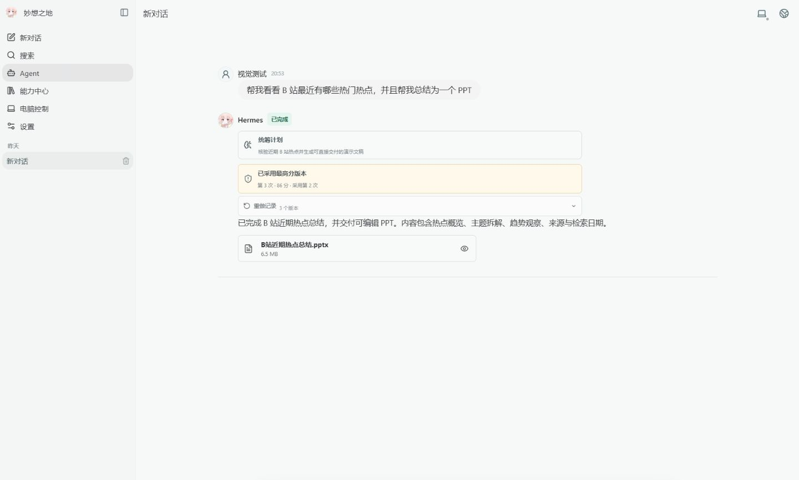
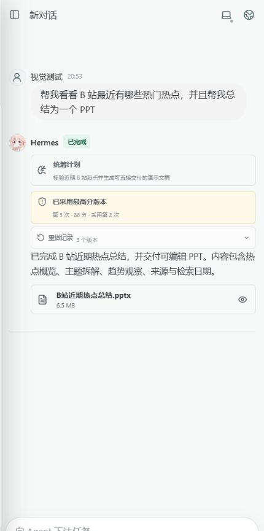
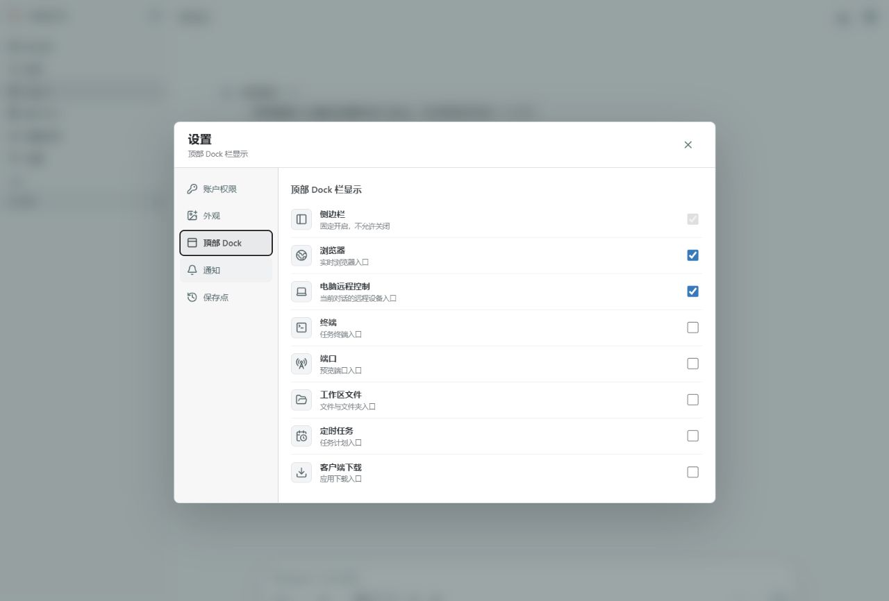
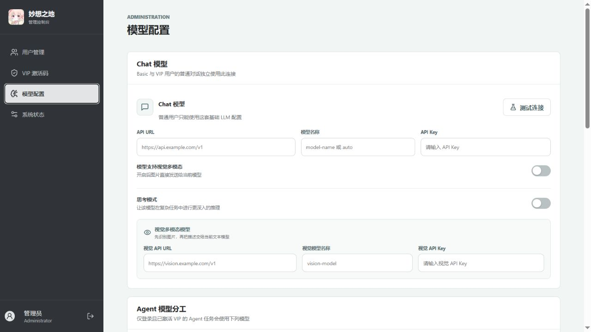

<p align="center">
  
</p>

<h1 align="center">妙想之地 AI 工作台</h1>

<p align="center">Chat、Hermes Agent、真实浏览器研究、定时任务与多端协作的一体化自托管工作台</p>

<p align="center">
  <a href="README.md">中文</a> ·
  <a href="README.en.md">English</a> ·
  <a href="README.ja.md">日本語</a>
</p>

## 申请体验

- 如需体验测试 Demo，请发送邮件至 [vrhjio4405@163.com](mailto:vrhjio4405@163.com)。收到申请后，维护者会通过邮件提供 Demo 地址和激活码。
- Agent 模式需要较多 CPU、内存和浏览器资源，长期使用建议自行部署。申请时请在邮件中注明：**愿意接受测试环境的容量、稳定性和资源限制**。

> 测试站仅用于体验，不应上传密码、密钥、私密文档或其他敏感资料。

## 界面预览

### 桌面 Agent 工作台



### 手机工作台与顶部 Dock 设置

<table>
  <tr>
    <td width="50%"></td>
    <td width="50%"></td>
  </tr>
</table>

### 管理后台模型分工



截图使用演示账户和演示任务生成，不包含真实聊天、API Key 或生产数据。

## 项目定位

妙想之地不是简单的聊天外壳，也不只会机械调用搜索接口。它将普通 Chat、Hermes Agent、真实浏览器、统筹模型、执行模型、质量验收、定时任务和多端工作台放在同一套账户、权限与会话体系中，适合持续研究、文档生产、开发协作、网页操作和远程电脑控制等自托管场景。

## 核心优势

- **真实浏览器研究**：Agent 可通过隔离 Chromium、CDP、截图和页面交互查询资料，不只依赖模型记忆或单一搜索摘要。
- **Hermes 长任务能力**：用户工作区支持终端、文件、技能、持久任务和 Cron 定时任务，复杂工作不必在一次请求后中断。
- **模型职责分离**：管理员可独立配置 Chat、统筹和执行模型。统筹模型负责计划、约束和验收，执行模型负责工具与产出，Chat 保持低延迟。
- **多维质量门控**：PPT、DOCX、视频等交付物使用文件类型契约；缺少文件、类型错误或验收不通过时可以进入修订流程。
- **浏览器证据优先**：研究工作流可以要求先查询和核对网页，再生成报告、文档或其他成果，降低仅凭模型记忆作答的风险。
- **选择性跨会话记忆**：新会话默认保持干净，由系统按需检索历史偏好，减少无关上下文和 token 消耗。
- **多端统一**：Web、Android、Windows 与微信小程序共享账户、会话和权限；客户端负责安全存储、通知、下载和系统桥接。
- **受控电脑操作**：Windows Agent 可结合 UI Automation、OCR、截图视觉和可选 ADB；高风险操作可要求批准，并提供本地急停机制。
- **Basic/VIP 服务端隔离**：Basic 用户仅使用管理员指定的基础 Chat 模型；VIP 才可使用 Agent、浏览器、文件、定时任务和电脑控制。
- **部署级密钥隔离**：每台机器首次初始化都生成独立密钥，同一激活码或内部令牌不能跨部署复用。

## 架构

```text
Web / Android / Windows / WeChat
                 |
              FastAPI
       +---------+----------+
       |         |          |
     Chat    Coordinator  Task Queue
                            |
                    Isolated Hermes Worker
                       |             |
                 Browser Runtime   Workspace
```

| 目录 | 说明 |
| --- | --- |
| `backend/` | FastAPI、SQLite、认证、权限、模型路由、任务调度和质量验收 |
| `frontend/` | React/Vite 响应式工作台和独立管理员后台 |
| `hermes-worker/` | 隔离 Hermes Worker、内置技能和浏览器工具包装 |
| `browser-runtime/` | Chromium、CDP、VNC/noVNC 运行环境 |
| `android-app/` | Android 原生容器、安全会话、通知、文件和在线更新 |
| `windows-client/` | Windows 工作台、UIA/OCR/ADB Computer Agent |
| `wechat-mini-program/` | 微信登录门和工作台容器 |
| `activation-manager/` | 通过管理 API 创建和管理 VIP 激活码 |
| `proxy-bridge/` | 可选的宿主机代理桥 |

## 快速开始

要求：Linux、Bash、Docker Engine、Docker Compose v2。源代码包不包含依赖目录、运行数据或已编译客户端。

```bash
unzip miaoxiang.zip
cd miaoxiang
bash scripts/start.sh
```

如果 `.env` 不存在，`start.sh` 会先运行交互式初始化；已经初始化时则直接启动。初始化会询问：

1. 应用名称、部署路径、Web 端口和公开 HTTPS 地址；
2. 管理员用户名和管理员密码；
3. 执行模型的 API URL、模型名和 API Key；
4. 是否需要单独的 Chat 模型，以及对应连接信息；
5. 是否需要并开启统筹模型，以及对应连接信息；
6. 可选的 SMTP 邮件设置；
7. 可选的微信 AppID、AppSecret 与云函数桥接配置。

示例中的 `https://api.example.com/v1`、`your-model-name` 和 `sk-your-key` 只是格式说明，不是真实服务或密钥。

```bash
bash scripts/start.sh   # 初始化（如有需要）并启动
bash scripts/status.sh  # 查看本项目容器和动态运行时
bash scripts/stop.sh    # 停止本项目，保留持久数据
```

## 模型和权限

所有模型连接均采用 OpenAI Chat Completions 兼容接口。

| 角色 | 用途 | 默认关系 |
| --- | --- | --- |
| Chat | 访客、Basic 与普通对话 | 可独立配置或继承执行模型 |
| Coordinator | 计划、分工、最终验收与修订引导 | 可关闭或使用独立模型 |
| Executor | Agent 工具调用和任务执行 | 主模型 |

普通用户只能使用基础 Chat 模式和管理员允许的模型。登录且已激活 VIP 的用户才可进入 Agent 模式以及浏览器、终端、文件、计划任务和电脑控制。管理员可在后台为单个用户调整权限，并分别更新 Chat、统筹和执行模型。

## 动态激活机制

- 首次初始化会生成当前部署独有的 `ACTIVATION_SECRET`，不写死在源码中。
- 每次后端启动都会创建新的加密轮次，并随机选择新的激活码摘要算法和注册链接认证算法；两类算法都保证与上一次不同。
- 当前实现分别从 HMAC-SHA-256、HMAC-SHA3-256、带密钥 BLAKE2 系列中选择，摘要和认证使用独立的算法集合。
- 每轮使用新的随机 salt，并从部署根密钥派生轮次密钥；数据库不保存激活码明文。
- 私有轮次状态存放在被 Git 忽略的运行数据目录，并带完整性认证。历史轮次保留用于验证已经签发且仍有效的激活码。
- 不同机器的根密钥和轮次状态不同，因此同一份源码部署到不同机器后，激活码不能互相通用。

## 安全与隐私

- `.env`、数据库、聊天记录、日志、用户工作区、API URL、API Key、签名材料和构建产物均不应提交。
- 初始化生成 `APP_SECRET`、`ACTIVATION_SECRET`、浏览器内部密钥、Hermes 内部密钥和可选微信桥接密钥；`.env` 权限设置为 `0600`。
- 模型 API Key 加密保存，管理接口只返回是否已配置，不返回密钥明文。
- 服务端、CDP、VNC 和 Worker 内部端口应只存在于容器网络，对外只暴露 Web 入口。
- 每个用户的 Hermes、浏览器配置、附件和工作区按用户隔离。
- 发布前建议启用 GitHub Secret Scanning 并复核提交历史；删除当前文件不会清除旧提交中的秘密。

## 客户端配置

- Web：构建时设置 `VITE_PUBLIC_APP_ORIGIN=https://your-domain.example`。
- Android：设置 `AICHAT_PUBLIC_ORIGIN=https://your-domain.example`；签名信息仅通过环境变量提供。
- Windows：首次运行前设置 `MIAOXIANG_SERVER_URL=https://your-domain.example`，也可使用 `--server` 覆盖。
- 微信小程序：发布前配置公开域名和云环境 ID，私密值通过平台环境变量注入。

## 上游项目

- [Hermes Agent](https://github.com/NousResearch/hermes-agent)
- [noVNC](https://github.com/novnc/noVNC)
- [Playwright](https://playwright.dev/)

## 许可与责任

请根据仓库实际许可证使用本项目。部署者应自行保护模型密钥、用户数据和公网入口，并遵守所接入模型、网站及自动化目标平台的服务条款。
